---
## Front matter
title: "Отчёт по лабораторной работе №4"
subtitle: "Основы интерфейса взаимодействия пользователя с системой Unix на уровне командной строки"
author: "Артамонов Тимофей Евгеньевич"

## Generic otions
lang: ru-RU
toc-title: "Содержание"

## Bibliography
bibliography: bib/cite.bib
csl: pandoc/csl/gost-r-7-0-5-2008-numeric.csl

## Pdf output format
toc: true # Table of contents
toc-depth: 2
lof: true # List of figures
lot: true # List of tables
fontsize: 12pt
linestretch: 1.5
papersize: a4
documentclass: scrreprt
## I18n polyglossia
polyglossia-lang:
  name: russian
  options:
	- spelling=modern
	- babelshorthands=true
polyglossia-otherlangs:
  name: english
## I18n babel
babel-lang: russian
babel-otherlangs: english
## Fonts
mainfont: PT Serif
romanfont: PT Serif
sansfont: PT Sans
monofont: PT Mono
mainfontoptions: Ligatures=TeX
romanfontoptions: Ligatures=TeX
sansfontoptions: Ligatures=TeX,Scale=MatchLowercase
monofontoptions: Scale=MatchLowercase,Scale=0.9
## Biblatex
biblatex: true
biblio-style: "gost-numeric"
biblatexoptions:
  - parentracker=true
  - backend=biber
  - hyperref=auto
  - language=auto
  - autolang=other*
  - citestyle=gost-numeric
## Pandoc-crossref LaTeX customization
figureTitle: "Рис."
tableTitle: "Таблица"
listingTitle: "Листинг"
lofTitle: "Список иллюстраций"
lotTitle: "Список таблиц"
lolTitle: "Листинги"
## Misc options
indent: true
header-includes:
  - \usepackage{indentfirst}
  - \usepackage{float} # keep figures where there are in the text
  - \floatplacement{figure}{H} # keep figures where there are in the text
---

# Цель работы

Приобретение практических навыков взаимодействия пользователя с системой посредством командной строки.

# Задание

1. Определите полное имя вашего домашнего каталога. Далее относительно этого каталога будут выполняться последующие упражнения.
2. Выполните следующие действия:

* Перейдите в каталог /tmp.
* Выведите на экран содержимое каталога /tmp. Для этого используйте команду ls с различными опциями. Поясните разницу в выводимой на экран информации.
* Определите, есть ли в каталоге /var/spool подкаталог с именем cron?
* Перейдите в Ваш домашний каталог и выведите на экран его содержимое. Определите, кто является владельцем файлов и подкаталогов?
* Выполните следующие действия:
* В домашнем каталоге создайте новый каталог с именем newdir.
* В каталоге ~/newdir создайте новый каталог с именем morefun.
* В домашнем каталоге создайте одной командой три новых каталога с именами letters, memos, misk. Затем удалите эти каталоги одной командой.
* Попробуйте удалить ранее созданный каталог ~/newdir командой rm. Проверьте, был ли каталог удалён.
* Удалите каталог ~/newdir/morefun из домашнего каталога. Проверьте, был ли
каталог удалён.
4. С помощью команды man определите, какую опцию команды ls нужно использовать для просмотра содержимое не только указанного каталога, но и подкаталогов,
входящих в него.
5. С помощью команды man определите набор опций команды ls, позволяющий отсортировать по времени последнего изменения выводимый список содержимого каталога
с развёрнутым описанием файлов.
6. Используйте команду man для просмотра описания следующих команд: cd, pwd, mkdir,
rmdir, rm. Поясните основные опции этих команд.
7. Используя информацию, полученную при помощи команды history, выполните модификацию и исполнение нескольких команд из буфера команд.

# Теоретическое введение

| Команда      | Смысл                                                                                    		                    |
|--------------|----------------------------------------------------------------------------------------------------------------------------|
| ` man `      | Информация о команде                                                                              			    |
| ` ls `       | Просмотр содержимого     												    |
| ` cd `        | Перемещение по каталогам                                       							    |
| ` mkdir `    | Создать директорию  													    |
| ` rm `       | Удалить файл\директорию                                                                                 		    |
| ` pwd `       | Абсолютный путь к файлу                                                                                   		    |
| ` history `   | Последние выполненные команды                                                                                             |

# Выполнение лабораторной работы

## Пункт 1
Вводим pwd чтобы узнать абсолютный путь. (рис. 1)

{рис. 1}

## Пункт 2

С помощью ls узнаём содержимое каталога. (рис. 2)

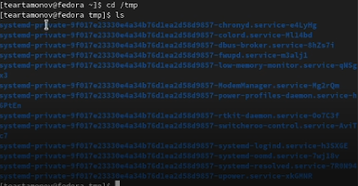{рис. 2}

С помощью ключа -а смотрим скрытые файлы. (рис. 3)

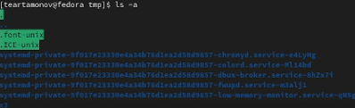{рис.3}

С помощью ключа -F смотрим тип данных. (рис. 4)

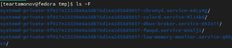{рис. 4}

С помощью ключа -l смотрим права доступа к данным. (рис. 5)

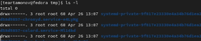{рис. 5}

С помощью всех ключей сразу смотрим все сразу. (рис. 6.1, 6.2)

{рис.6.1}

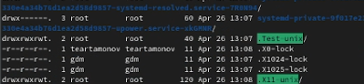{рис.6.2}

Смотрим есть ли каталог cron. (рис. 7)

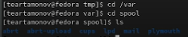{рис. 7}

Смотрим и выводим на экран содержимое домашнего каталога, смотрим владельца. (рис. 8)

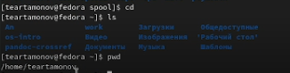{рис. 8}

## Пункт 3

Создаём указанные каталоги (рис. 9.1)

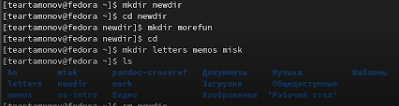{рис. 9.1}

Пытаемся удалить указанные каталоги (рис. 9.2)

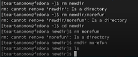{рис. 9.2}

## Пункт 4

С помощью man нашли ключ для ls, который показывает содержимое каталогов. (рис. 10)
 
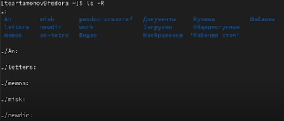{рис. 10}

## Пункт 5

С помощью man нашли ключ для ls, который сортирует данные по времени изменения. (рис. 11)
 
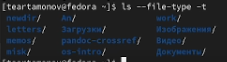{рис. 11}

## Пункт 7

Смотрим историю команд с помощью history. (рис. 12)

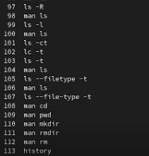{рис. 12}

Вызываем команда по номеру и меняем ее параметры. (рис. 13)
{рис.13}

# Контрольные вопросы
1. Командная строка - способ обращения к системе.
2. pwd
3. ls -F
4. ls -a
5. rm / rmdir для файлов и каталогов / пустых каталогов. Можно удалить и то и другое с помощью rm -R.
6. history
7. !номер команды:s/что меняем/на что (!95:s/a/F, если !95 --- ls -a)
8. cd; ls
9. Символ экранирования нужен, например, для того, чтобы ввести в командную строку название файла, в названии которого есть пробел.(../Operating\ /Systems/..)
10. ls -l показывает права доступа и прочую информацию о файле, такую как, например, дата последнего изменения и размер.
11. Относительный путь - путь к файлу относительно текущего расположения (cd Downloads, находясь в home)(cd ~/Downloads, находясь в любом месте).
12. man ` команда `
13. Tab

# Выводы

Научились взаимодействовать с командной строкой в Unix\Linux.

# Список литературы

- Мой мозг
- Мой разум
- Моё сознание
- Лабораторная работа 4
